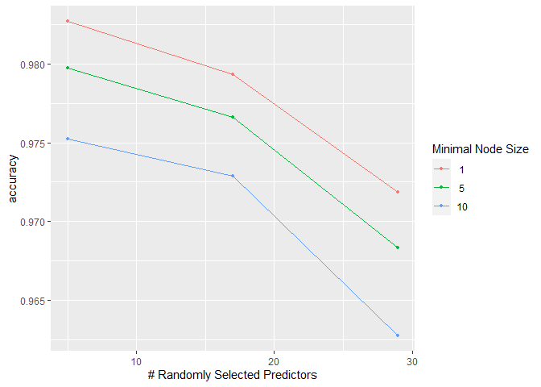

## Summary
A total of 6 participants were asked to perform a weight lifting exercise in one of 5 ways (labeled A-E) while wearing equipment that recorded kinematic data. A `train` data frame containing the experimental observations is provided, and our aim in this report will be to fit a model on the `train` set in order to correctly classify 20 new observations in a `test` set.  

We detail the model selection process and performance evaluation below.

## Prerequisites

We will be using the `tidyverse` and `tidymodels` packages.


```r
library(tidyverse)
library(tidymodels)
```

In particular, we will be using the more recent `parsnip` engine from `tidymodels` rather than `caret` as in the lectures. I found the `tidymodels` framework interesting and thought it would be valuable for the reviewer to see a demonstration. A good introduction to learn these packages is the online book [Tidy Models with R](https://www.tmwr.org/) and author Julia Silge's [blog](https://juliasilge.com/).

## Downloading the data:


```r
train_url <- "https://d396qusza40orc.cloudfront.net/predmachlearn/pml-training.csv"
test_url <- "https://d396qusza40orc.cloudfront.net/predmachlearn/pml-testing.csv"

if (!file.exists("training.csv")){
  download.file(train_url,"training.csv")
  download.file(test_url, "testing.csv")
}

train <- read_csv("training.csv")
test <- read_csv("testing.csv")
```

## Model selection and specification

Since our aim is to maximise prediction accuracy, we will fit a **random forest** model using the `randomForest` package. We choose the random forest due to its reputation for having great out-of-the-box performance with minimal tuning required. 


```r
rf_model <- rand_forest(trees = 450, min_n = tune(), mtry = tune()) %>%
  set_engine("randomForest") %>%
  set_mode("classification")
```

We have made the following choices for the hyperparameters:

* `trees = 450` : As we will see below, after feature engineering and selection we will have a set of 29 PCA components left as features. A typical rule is to set the number of trees to at least 10 times the number of features, so we meet this requirement.

* `min_n` and `mtry` have been set equal to `tune()`. This will allow us to perform a grid search below over a range of values for each of these parameters. `min_n` is the minimum node-size in each tree, while `mtry` corresponds to the number of randomly selected predictors that would be considered at each split when bulding a tree.

## Feature selection and engineering
The first few observations of the `train` frame are shown below

```r
train %>% head(5)
```

```
## # A tibble: 5 x 160
##      X1 user_name raw_timestamp_par~ raw_timestamp_pa~ cvtd_timestamp new_window
##   <dbl> <chr>                  <dbl>             <dbl> <chr>          <chr>     
## 1     1 carlitos          1323084231            788290 05/12/2011 11~ no        
## 2     2 carlitos          1323084231            808298 05/12/2011 11~ no        
## 3     3 carlitos          1323084231            820366 05/12/2011 11~ no        
## 4     4 carlitos          1323084232            120339 05/12/2011 11~ no        
## 5     5 carlitos          1323084232            196328 05/12/2011 11~ no        
## # ... with 154 more variables: num_window <dbl>, roll_belt <dbl>,
## #   pitch_belt <dbl>, yaw_belt <dbl>, total_accel_belt <dbl>,
## #   kurtosis_roll_belt <chr>, kurtosis_picth_belt <chr>,
## #   kurtosis_yaw_belt <chr>, skewness_roll_belt <chr>,
## #   skewness_roll_belt.1 <chr>, skewness_yaw_belt <chr>, max_roll_belt <dbl>,
## #   max_picth_belt <dbl>, max_yaw_belt <chr>, min_roll_belt <dbl>,
## #   min_pitch_belt <dbl>, min_yaw_belt <chr>, amplitude_roll_belt <dbl>,
## #   amplitude_pitch_belt <dbl>, amplitude_yaw_belt <chr>,
## #   var_total_accel_belt <dbl>, avg_roll_belt <dbl>, stddev_roll_belt <dbl>,
## #   var_roll_belt <dbl>, avg_pitch_belt <dbl>, stddev_pitch_belt <dbl>,
## #   var_pitch_belt <dbl>, avg_yaw_belt <dbl>, stddev_yaw_belt <dbl>,
## #   var_yaw_belt <dbl>, gyros_belt_x <dbl>, gyros_belt_y <dbl>,
## #   gyros_belt_z <dbl>, accel_belt_x <dbl>, accel_belt_y <dbl>,
## #   accel_belt_z <dbl>, magnet_belt_x <dbl>, magnet_belt_y <dbl>,
## #   magnet_belt_z <dbl>, roll_arm <dbl>, pitch_arm <dbl>, yaw_arm <dbl>,
## #   total_accel_arm <dbl>, var_accel_arm <dbl>, avg_roll_arm <dbl>,
## #   stddev_roll_arm <dbl>, var_roll_arm <dbl>, avg_pitch_arm <dbl>,
## #   stddev_pitch_arm <dbl>, var_pitch_arm <dbl>, avg_yaw_arm <dbl>,
## #   stddev_yaw_arm <dbl>, var_yaw_arm <dbl>, gyros_arm_x <dbl>,
## #   gyros_arm_y <dbl>, gyros_arm_z <dbl>, accel_arm_x <dbl>, accel_arm_y <dbl>,
## #   accel_arm_z <dbl>, magnet_arm_x <dbl>, magnet_arm_y <dbl>,
## #   magnet_arm_z <dbl>, kurtosis_roll_arm <dbl>, kurtosis_picth_arm <chr>,
## #   kurtosis_yaw_arm <chr>, skewness_roll_arm <dbl>, skewness_pitch_arm <chr>,
## #   skewness_yaw_arm <chr>, max_roll_arm <dbl>, max_picth_arm <dbl>,
## #   max_yaw_arm <dbl>, min_roll_arm <dbl>, min_pitch_arm <dbl>,
## #   min_yaw_arm <dbl>, amplitude_roll_arm <dbl>, amplitude_pitch_arm <dbl>,
## #   amplitude_yaw_arm <dbl>, roll_dumbbell <dbl>, pitch_dumbbell <dbl>,
## #   yaw_dumbbell <dbl>, kurtosis_roll_dumbbell <dbl>,
## #   kurtosis_picth_dumbbell <dbl>, kurtosis_yaw_dumbbell <chr>,
## #   skewness_roll_dumbbell <dbl>, skewness_pitch_dumbbell <dbl>,
## #   skewness_yaw_dumbbell <chr>, max_roll_dumbbell <dbl>,
## #   max_picth_dumbbell <dbl>, max_yaw_dumbbell <dbl>, min_roll_dumbbell <dbl>,
## #   min_pitch_dumbbell <dbl>, min_yaw_dumbbell <dbl>,
## #   amplitude_roll_dumbbell <dbl>, amplitude_pitch_dumbbell <dbl>,
## #   amplitude_yaw_dumbbell <dbl>, total_accel_dumbbell <dbl>,
## #   var_accel_dumbbell <dbl>, avg_roll_dumbbell <dbl>,
## #   stddev_roll_dumbbell <dbl>, var_roll_dumbbell <dbl>, ...
```
The first 5 columns will not be used in the predictive model for the following reasons:

* `X1` simply contains the row number for the observation. Since this is just a bookkeeping variable, it should have no predictive value.
* `user_name` specifies the name of the person performing the exercise. While this may have some value if we were to predict on an observation by one of the 6 subjects in the original study, we would not expect it to generalise to a previously unseed individual. 
* The next 3 columns contain information about the time and date on which the observation was recorded. Again, we should not expect this information to be useful in making predictions about new data. 


Let's also look at the distribution of missing values across the remaining features:


```r
missing <- train %>% 
  select(-1, -classe, -contains("timestamp"), -user_name) %>%
  mutate(across(everything(), is.na)) %>%
  summarise(across(everything(), mean)) %>%
  gather(everything(), key = "feature", value = "missing_frac") 

missing %>% count(missing_frac)
```

```
## # A tibble: 8 x 2
##   missing_frac     n
##          <dbl> <int>
## 1        0        54
## 2        0.979    91
## 3        0.979     1
## 4        0.979     1
## 5        0.980     1
## 6        0.980     4
## 7        0.983     1
## 8        0.983     1
```
We see that there are 54 predictors left with 0 missing values, while the other predictors have in excess of 97% missing values. We will drop all these extra features, leaving us with a final set of 54 predictors that we put in a `features` character vector:


```r
features <- missing %>%
  filter(missing_frac == 0) %>%
  .$feature
```

Next, we will create a pre-processing object `rf_recipe` that selects these features for use in our model, and further performs some engineering like normalization and dimension reduction using PCA.

```r
rf_recipe <- recipe(classe ~ ., data = train) %>%
  step_rm(-all_of(features), -classe) %>% #keep only outcome & our 54 features
  step_nzv(all_predictors()) %>% #discard near-zero variance predictors
  step_YeoJohnson(all_numeric()) %>% 
  step_normalize(all_numeric()) %>% #scales and centres all numeric predictors
  step_pca(all_numeric(), threshold = .95) #calculate PCA components
```

We have chosen `threshold = 0.95` for the PCA extraction, as this is a typical value
in the literature for similar problems. We could also have set it to `tune()` to include it in our grid search, but decided against it to keep computational requirements to a manageable level. 

We can get a sense of what `rf_recipe` achieves by applying it to the `train` set:


```r
rf_recipe %>% prep(train) %>% bake(train)
```

```
## # A tibble: 19,622 x 30
##    classe  PC01     PC02  PC03  PC04  PC05  PC06  PC07  PC08  PC09   PC10
##    <fct>  <dbl>    <dbl> <dbl> <dbl> <dbl> <dbl> <dbl> <dbl> <dbl>  <dbl>
##  1 A       3.90 -0.0580  -2.91 0.673 -2.38 0.948  2.39 0.219 0.913 -0.817
##  2 A       3.90  0.0341  -2.92 0.781 -2.52 1.00   2.30 0.232 0.944 -0.835
##  3 A       3.94 -0.106   -2.90 0.671 -2.38 0.960  2.36 0.213 0.938 -0.806
##  4 A       3.90 -0.00867 -2.90 0.724 -2.46 0.980  2.29 0.229 0.971 -0.804
##  5 A       3.92 -0.0618  -2.87 0.735 -2.51 0.988  2.30 0.266 0.926 -0.852
##  6 A       3.94 -0.149   -2.90 0.673 -2.38 0.951  2.37 0.237 0.939 -0.808
##  7 A       3.88 -0.0338  -2.89 0.695 -2.42 0.989  2.35 0.237 0.948 -0.838
##  8 A       3.90 -0.105   -2.91 0.706 -2.42 0.986  2.37 0.230 0.945 -0.818
##  9 A       3.98 -0.130   -2.87 0.648 -2.34 0.937  2.36 0.215 0.926 -0.794
## 10 A       3.97 -0.107   -2.90 0.763 -2.48 0.984  2.32 0.243 0.904 -0.808
## # ... with 19,612 more rows, and 19 more variables: PC11 <dbl>, PC12 <dbl>,
## #   PC13 <dbl>, PC14 <dbl>, PC15 <dbl>, PC16 <dbl>, PC17 <dbl>, PC18 <dbl>,
## #   PC19 <dbl>, PC20 <dbl>, PC21 <dbl>, PC22 <dbl>, PC23 <dbl>, PC24 <dbl>,
## #   PC25 <dbl>, PC26 <dbl>, PC27 <dbl>, PC28 <dbl>, PC29 <dbl>
```

We see that a total of 29 PCA components have been extracted and will be used in the final model. 

## Assembling workflow

Having specified a model and recipe, these can now be combined in a `workflow`:


```r
rf_workflow <- workflow() %>%
  add_recipe(rf_recipe) %>%
  add_model(rf_model)
```

We now manually specify some range of values for the two parameters we intend to tune:


```r
rf_params <- rf_workflow %>%
  parameters() %>%
  update(
    min_n = min_n(c(1, 10)),
    mtry = mtry(c(5,29))
  )
```

## Creating Resampling Folds
We'll use 5-fold cross validation to evaluate model performance. We choose this over 10-fold CV to reduce computational demands. The following code uses the `rsample` package to create the resamples and puts them in a `train_folds` object:


```r
train_folds <- vfold_cv(train, v = 5)
```

## Performing grid search and fitting final model

We can now perform the grid search by calling the `tune_grid` function on our `rf_workflow` object. For the `grid` argument, we take our `rf_params` object that contains our parameter ranges, and pass it to `grid_regular()` with `levels = 3`. This creates 3x3 cartesian grid of parameter values. There are 3 equally spaced values for both `mtry` and `min_n` across the ranges specified above, giving us a total of 9 different models. 


```r
set.seed(123)

rf_tune <- rf_workflow %>%
  tune_grid(
    train_folds,
    grid = rf_params %>% grid_regular(levels = 3),
    metrics = metric_set(accuracy)
  )
```

Each of the nine models is fit and evaluated on the `train_folds` object. The `autoplot()` function allows us to compare the accuracy estimates for each of these models:


```r
autoplot(rf_tune)
```

<!-- -->

We see that our best model is that with `mtry = 5` and `min_n = 1`. Based on the observed trend, we could perform another grid search investigating the smaller values of `mtry`, but for the purposes of this assignment this is good enough. We now finalise our workflow with these parameter values, and fit it to the training data:

```r
best_params <- rf_tune %>% select_best() %>% select(-.config)
final_rf_workflow <- rf_workflow %>% finalize_workflow(best_params)

final_rf_fit <- final_rf_workflow %>% fit(train)
```


## Predicting on the test set:

The estimated accuracy for our best model, as seen on the plot above, exceeds 98%. Therefore, since there are 20 observations in the test set, an expected value for the number of correct predictions is simply $20\cdot 0.98 = 19.6$, i.e. we expect to get almost all of them correct.

We make our predictions using the code below:

```r
predictions <- predict(final_rf_fit, test)

predictions
```

```
## # A tibble: 20 x 1
##    .pred_class
##    <fct>      
##  1 B          
##  2 A          
##  3 B          
##  4 A          
##  5 A          
##  6 E          
##  7 D          
##  8 B          
##  9 A          
## 10 A          
## 11 B          
## 12 C          
## 13 B          
## 14 A          
## 15 E          
## 16 E          
## 17 A          
## 18 B          
## 19 B          
## 20 B
```


Entering these values into the course project prediction quiz confirms that we indeed achieved 100% accuracy on the test set. 
